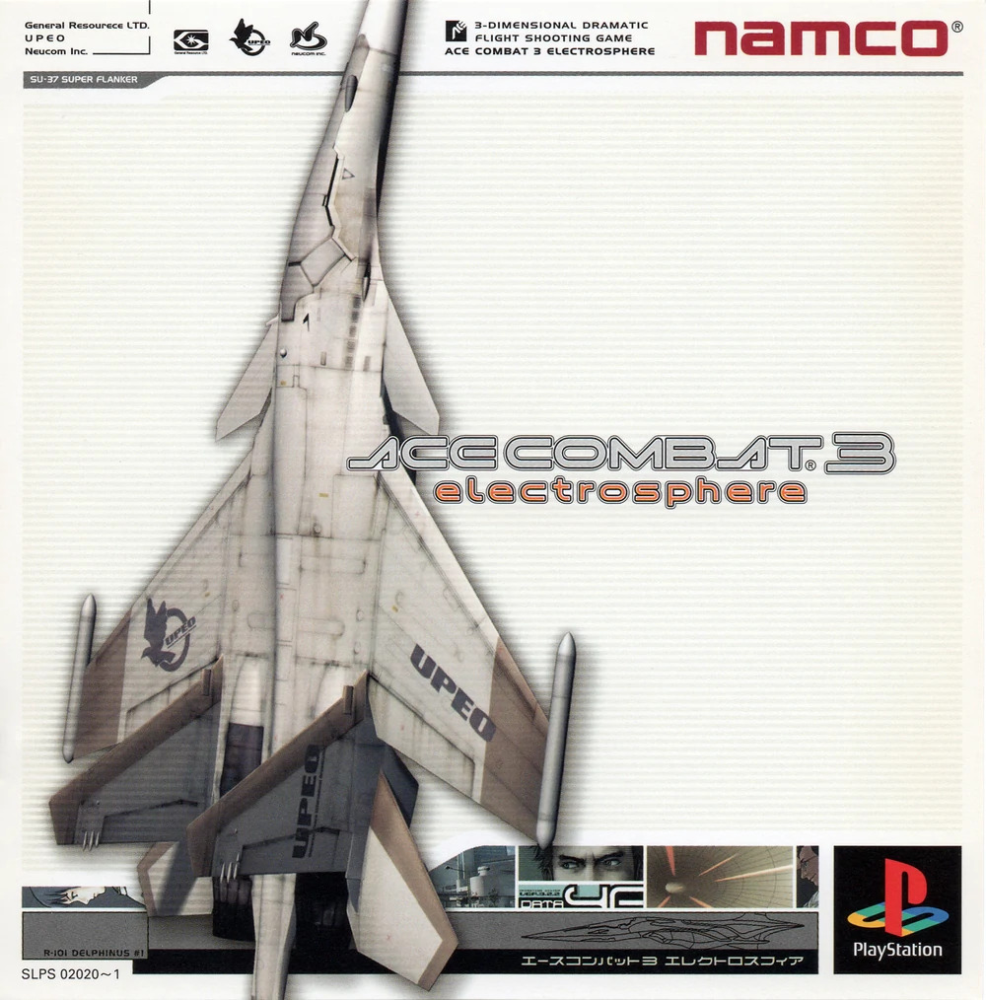
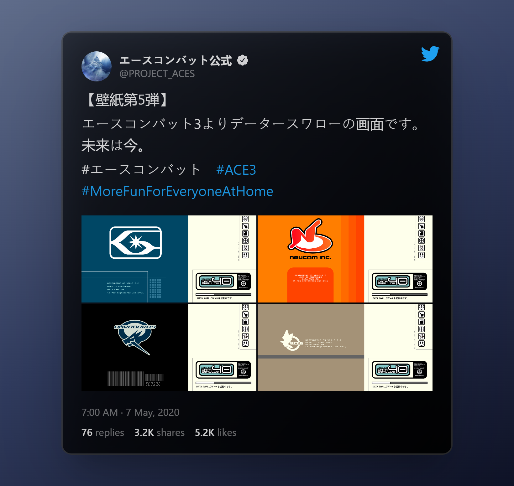
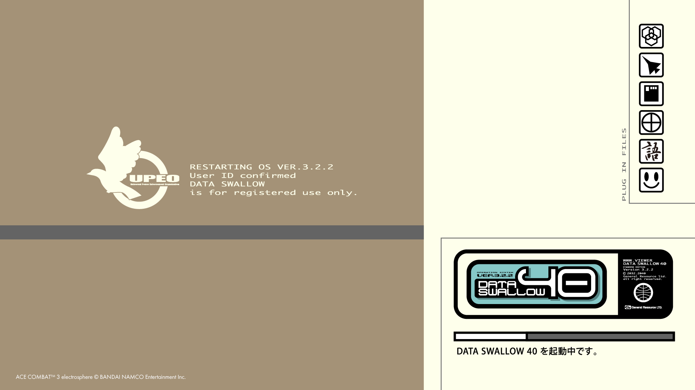
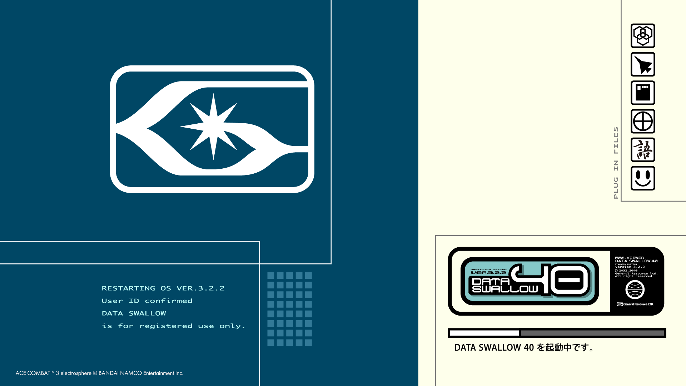
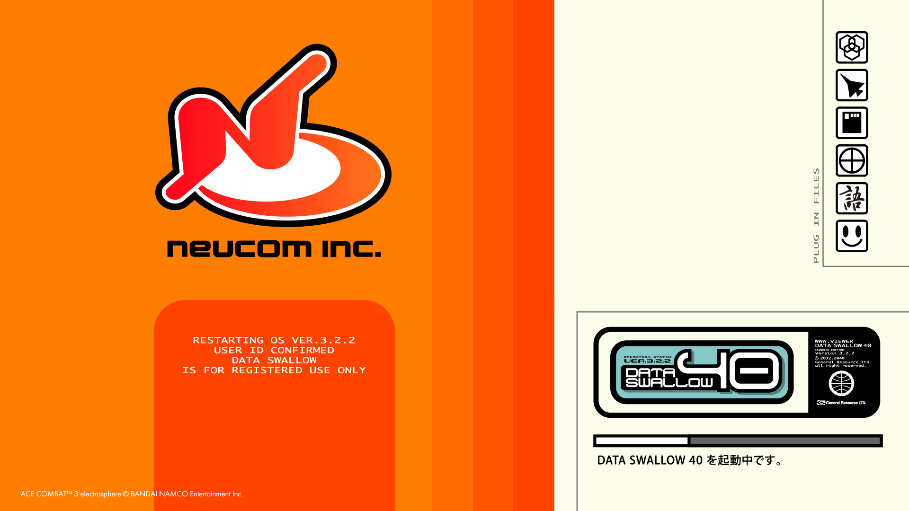
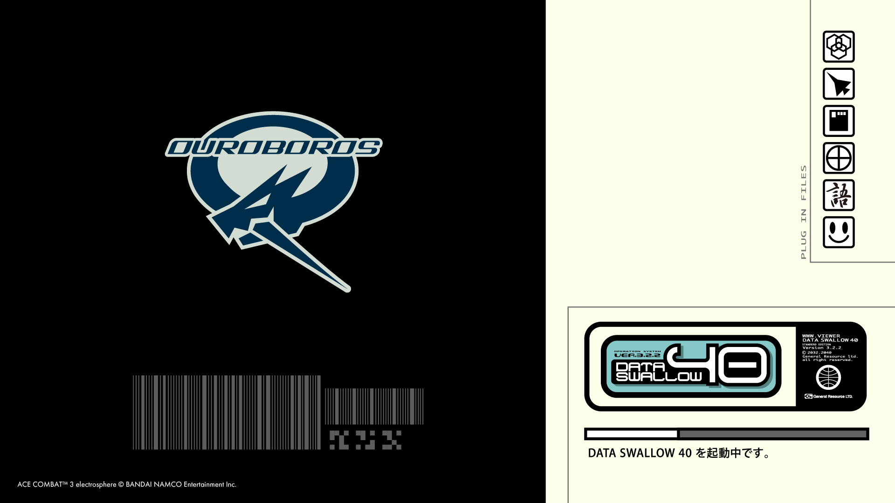
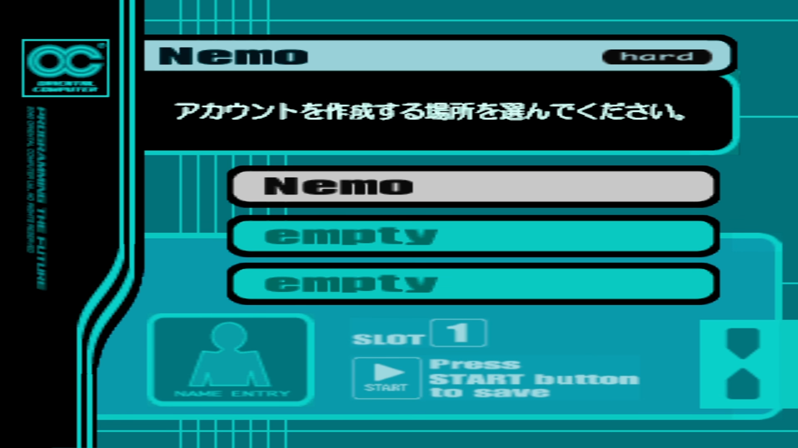

# Ace Combat 3 Boot Screens

> ⚠️ **Disclaimer** This is just a tribute project done for mere fun and practice. I am not related in any way to any of the companies involved in the development/publishing of the game. All the credits for the original content correspond to the original Namco team and now Bandai Namco Entertainment Inc.

## Info

This is my humble tribute to one of my favorite games of my childhood that I still replay in my adulthood.

Ace Combat 3: Electrosphere. _A 3-Dimensional Dramatic Flight Shooting Game_. A 1999 game originally developed and published by Namco (now Bandai Namco).

This game features great mechanics, delightful graphics, UI, and animations and an out-of-this-world soundtrack, that combined with a mindblowing immersive story made it a classic for sci-fi lovers as me.

Outside of the Japanese market, this game was only known for its arcade version, which had all the good stuff that I named before, but lacked the most important part: the story. Luckily for us, almost two decades later, thanks to [Project Nemo](https://projectnemo.net/wiki/index.php/ProjectNemo/Home) that provided a full english translation, a lot of us were able to play it as it was originally conceived.

## References

I used the images provided by a [tweet](https://twitter.com/PROJECT_ACES/status/1258335767035813888) from Project Aces' Twitter account.

The images were the loading screens for the four factions of the game story:

1. UPEO:

2. General Resource:

3. Neucom:

4. Ouroboros:

_All the high-res images can be found in the [assets folder](./assets/)._

And also used one of the game settings screens as a reference to the main page:

## Development

I recreated the logos and other assets as faithfully as possible and converted them into SVG code using Figma and Adobe Illustrator, then I added some simple CSS animations to give them a special touch when the screen is loading.

This project is done in React with TypeScript. I used Tailwind CSS for the general layout structure, while I used CSS modules for the specific logos animations. I also used Next.js as the framework to take advantage of its file-based routing system, and static HTML generation for its pages, as well as other cool features that I might use to expand the project in the future.

## Conclusion

This was a really fun project to make and felt like a way to retribute the good moments I spent playing the game and the world it opened to me related to sci-fi.
